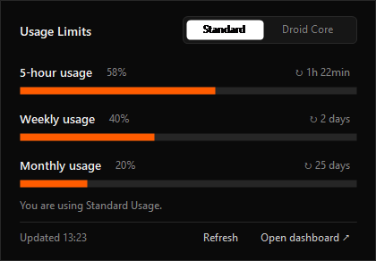

# Droid Bar for Windows

A small Windows tray app that shows your [Factory](https://factory.ai) Droid usage limits (5-hour, weekly and monthly, for both **Standard** and **Droid Core**) and notifies you when you get close to a limit.



> Unofficial. Not affiliated with or endorsed by Factory. It reads the same `/api/billing/limits` endpoint the Droid CLI uses. That endpoint isn't documented and may change.

## Features

- **Tray icon with your current usage.** It shows the highest Standard percentage and changes color as you approach the limit: dark below 75%, orange from 75%, red from 90%. Hover it for a summary.
- **Popup on left click**, styled like Factory's own usage page, with Standard / Droid Core tabs and the time left until each window resets.
- **Notifications** when a limit crosses 75%, 90% and 100% (once per threshold), and when a maxed-out limit becomes available again.
- **Right-click menu**: refresh now, open the Factory dashboard, set API key, start with Windows, quit.
- Nothing to install. It runs on Windows PowerShell 5.1 and .NET Framework, which ship with Windows 10/11.

## Install

1. Download `DroidBar-vX.Y.Z.zip` from [Releases](https://github.com/soaresfellipe/droidbar-windows/releases) and extract it anywhere (e.g. `C:\Tools\DroidBar`). Keep `DroidBar.exe` and `droid-bar.ps1` in the same folder.
2. Run `DroidBar.exe`.
3. On first run it asks for a **Factory API key**. Create one at [app.factory.ai/settings/api-keys](https://app.factory.ai/settings/api-keys).
4. Optional: right-click the icon and check **Start with Windows**.
5. Optional: in *Settings → Personalization → Taskbar → Other system tray icons*, turn **Droid Bar** on so the icon is always visible.

Windows SmartScreen may warn about the unsigned executable. You can also skip the exe and run the script directly (see below).

## Configuration

Settings live in `%APPDATA%\droid-bar\config.json` (right-click → **Open settings folder**). Restart the app after editing.

| Key | Default | Description |
| --- | --- | --- |
| `pollMinutes` | `5` | How often to query the API. |
| `thresholds` | `[75, 90, 100]` | Usage percentages that trigger a notification. |
| `notifyPools` | `["standard", "core"]` | Which limit pools send notifications. |
| `trayPool` | `"standard"` | Which pool the tray icon number reflects. |
| `apiBase` | `"https://api.factory.ai"` | API base URL. |

The `FACTORY_API_KEY` environment variable, if set, takes precedence over the stored key.

## Privacy

- The API key is encrypted with Windows DPAPI, so only your Windows user can decrypt it. It is stored in `config.json`.
- The only network calls go to `api.factory.ai`. There's no telemetry.
- Errors are logged to `%APPDATA%\droid-bar\droid-bar.log`. The log never includes the key.

## Run the script directly

```powershell
powershell -NoProfile -ExecutionPolicy Bypass -File droid-bar.ps1
```

Developer flags:

| Flag | What it does |
| --- | --- |
| `-Mock samples\mock.json` | Use a local JSON file instead of the API. |
| `-Preview out.png` | Render the popup (and tray icon) to PNG and exit. |
| `-Dump` | Print the raw API response and exit. |

`DroidBar.exe` passes the same flags through, e.g. `DroidBar.exe -Mock samples\mock.json`.

## Build

`DroidBar.exe` is a tiny host that runs `droid-bar.ps1` in-process, so Windows lists the app as "Droid Bar" instead of "Windows PowerShell". To build it:

```powershell
powershell -NoProfile -ExecutionPolicy Bypass -File build.ps1
```

This generates `src\droid-bar.ico` and compiles `DroidBar.exe` with the C# compiler that ships with .NET Framework 4 (`csc.exe`). No SDK needed.

## License

[MIT](LICENSE)
