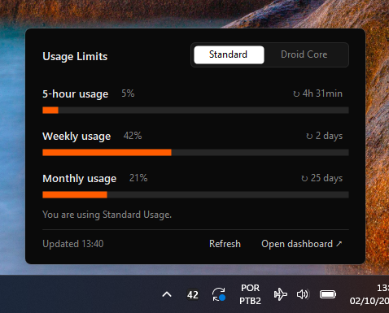
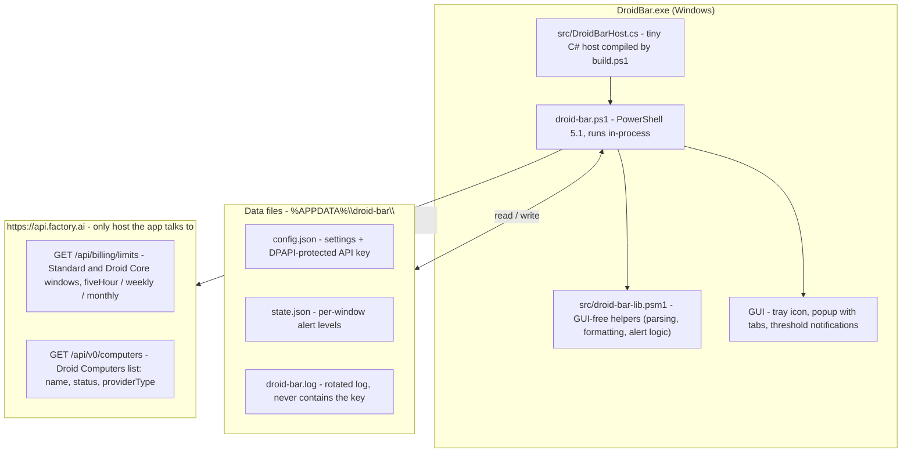

# Droid Bar for Windows

A small Windows tray app that shows your [Factory](https://factory.ai) Droid usage limits (5-hour, weekly and monthly, for both **Standard** and **Droid Core**) and notifies you when you get close to a limit.



> Unofficial. Not affiliated with or endorsed by Factory. It reads the same `/api/billing/limits` endpoint the Droid CLI uses. That endpoint isn't documented and may change.

## What's new in v1.1.0

The current release is **v1.1.0** (see [Releases](https://github.com/soaresfellipe/droidbar-windows/releases)).

- **Computer tab** — a third popup tab listing your Droid Computers with a summary line
  (e.g. `3 computers · 3 active`) and one row per machine: name, provider type and a color-coded
  status chip (active, paused, provisioning, failed, unknown). It is **status only**: the API exposes
  **no hours balance** for Droid Computers, because their compute counts toward the Standard windows
  that the Standard tab already meters. If the computers call fails, the tab shows an unavailable
  state and the Standard / Droid Core tabs keep working.
- **`-PreviewTab <id>` developer flag** — renders a specific tab (`standard`, `core`, `computer`)
  to PNG for CI artifact review.
- **The release zip now ships `src/droid-bar-lib.psm1`**, the GUI-free helper module the script
  imports at runtime, so the zip layout matches what the code expects.
- Repo hygiene from the Agent-Readiness work: `AGENTS.md`, Pester suite, PSScriptAnalyzer settings,
  CI workflow, contribution templates and CODEOWNERS.

## Features

- **Tray icon with your current usage.** It shows the highest Standard percentage and changes color as you approach the limit: dark below 75%, orange from 75%, red from 90%. Hover it for a summary.
- **Popup on left click**, styled like Factory's own usage page, with Standard / Droid Core / Computer tabs and the time left until each window resets.
- **Computer tab**, display-only: a summary line (e.g. `3 computers · 3 active`) and one row per Droid Computer with its name, provider type and a color-coded status chip. There is no hours balance for Droid Computers — their compute counts toward the Standard windows — so this tab shows status, not a meter. Computers never trigger notifications.
- **Notifications** when a limit crosses 75%, 90% and 100% (once per threshold), and when a maxed-out limit becomes available again.
- **Right-click menu**: refresh now, open the Factory dashboard, set API key, start with Windows, quit.
- Nothing to install. It runs on Windows PowerShell 5.1 and .NET Framework, which ship with Windows 10/11.

## How it works

`DroidBar.exe` is a tiny C# host that runs `droid-bar.ps1` in-process (so Windows lists the app as "Droid Bar" instead of "Windows PowerShell"). The script imports `src\droid-bar-lib.psm1` — a GUI-free helper module (parsing, formatting, alert logic) that is unit-tested with Pester — polls the Factory API on a timer, keeps your API key encrypted with DPAPI, and does all the tray/popup/notification work.



All settings and state live in `%APPDATA%\droid-bar\` (see [Configuration](#configuration)). The API key is only ever sent as a Bearer token to `api.factory.ai` — no telemetry, no other hosts. A fuller walkthrough lives in [docs/architecture.md](docs/architecture.md).

## Install

1. Download `DroidBar-v1.1.0.zip` from [Releases](https://github.com/soaresfellipe/droidbar-windows/releases) and extract it anywhere (e.g. `C:\Tools\DroidBar`). The zip has this layout — keep it intact:

   ```text
   DroidBar.exe
   droid-bar.ps1
   src\droid-bar-lib.psm1
   README.md
   LICENSE
   ```

   `droid-bar.ps1` imports `src\droid-bar-lib.psm1` at startup, so the `src\` folder must stay next to the script.
2. Run `DroidBar.exe`.
3. On first run it asks for a **Factory API key**. Create one at [app.factory.ai/settings/api-keys](https://app.factory.ai/settings/api-keys).
4. Optional: right-click the icon and check **Start with Windows**.
5. Optional: in *Settings → Personalization → Taskbar → Other system tray icons*, turn **Droid Bar** on so the icon is always visible.

Windows SmartScreen may warn about the unsigned executable. You can also skip the exe and run the script directly (see below).

## Configuration

Settings live in `%APPDATA%\droid-bar\config.json` (right-click → **Open settings folder**). Restart the app after editing.

| Key | Default | Description |
| --- | --- | --- |
| `pollMinutes` | `5` | How often to query the API. |
| `thresholds` | `[75, 90, 100]` | Usage percentages that trigger a notification. |
| `notifyPools` | `["standard", "core"]` | Which limit pools send notifications. |
| `trayPool` | `"standard"` | Which pool the tray icon number reflects. |
| `apiBase` | `"https://api.factory.ai"` | API base URL. |
| `apiKeyProtected` | *(empty)* | The API key, encrypted with DPAPI. Set through **Set API key** in the right-click menu rather than by hand. |

The `FACTORY_API_KEY` environment variable, if set, takes precedence over the stored key.

## Privacy

- The API key is encrypted with Windows DPAPI, so only your Windows user can decrypt it. It is stored in `config.json`.
- The only network calls go to `api.factory.ai`. There's no telemetry.
- Errors are logged to `%APPDATA%\droid-bar\droid-bar.log`. The log never includes the key.

## Run the script directly

```powershell
powershell -NoProfile -ExecutionPolicy Bypass -File droid-bar.ps1
```

Developer flags:

| Flag | What it does |
| --- | --- |
| `-Mock samples\mock.json` | Use a local JSON file instead of the API. |
| `-Preview out.png` | Render the popup (and tray icon) to PNG and exit. |
| `-PreviewTab <id>` | With `-Preview`: which tab to render — `standard` (default), `core` or `computer`. |
| `-Dump` | Print the raw API response and exit. |

`DroidBar.exe` passes the same flags through, e.g. `DroidBar.exe -Mock samples\mock.json`.

## Build

`DroidBar.exe` is a tiny host that runs `droid-bar.ps1` in-process, so Windows lists the app as "Droid Bar" instead of "Windows PowerShell". To build it:

```powershell
powershell -NoProfile -ExecutionPolicy Bypass -File build.ps1
```

This generates `src\droid-bar.ico` and compiles `DroidBar.exe` with the C# compiler that ships with .NET Framework 4 (`csc.exe`). No SDK needed.

## License

[MIT](LICENSE)
