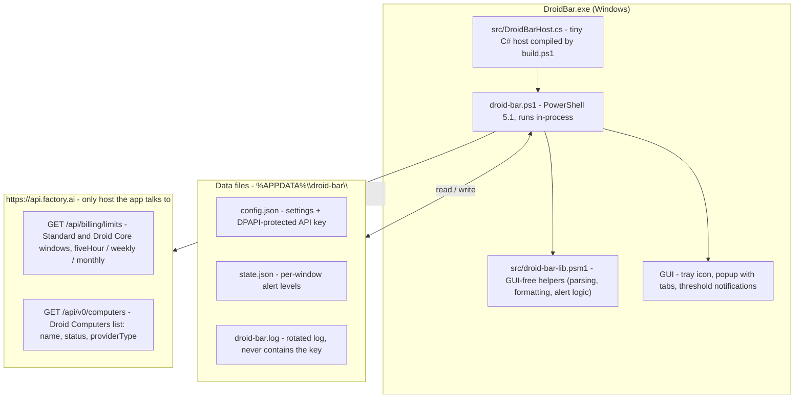

# Droid Bar for Windows

A small Windows tray app that shows your [Factory](https://factory.ai) Droid usage limits (5-hour, weekly and monthly, for both **Standard** and **Droid Core**) and notifies you when you get close to a limit.


> Unofficial. Not affiliated with or endorsed by Factory. It reads the same `/api/billing/limits` endpoint the Droid CLI uses. That endpoint isn't documented and may change.

## What's new in v1.1.0

The current release is **v1.1.0** (see [Releases](https://github.com/soaresfellipe/droidbar-windows/releases)).

- **Computer tab** — a third popup tab listing your Droid Computers with a summary line
  (e.g. `3 computers · 3 active`) and one row per machine: name, provider type and a color-coded
  status chip (active, paused, provisioning, failed, unknown). It is **status only**: the API exposes
  **no hours balance** for Droid Computers, because their compute counts toward the Standard windows
  that the Standard tab already meters. If the computers call fails, the tab shows an unavailable
  state and the Standard / Droid Core tabs keep working.
- **`-PreviewTab <id>` developer flag** — renders a specific tab (`standard`, `core`, `computer`)
  to PNG for CI artifact review.
- **The release zip now ships `src/droid-bar-lib.psm1`**, the GUI-free helper module the script
  imports at runtime, so the zip layout matches what the code expects.
- **Repo hygiene from the Agent-Readiness work:** `AGENTS.md`, a Pester suite with an enforced
  coverage floor, PSScriptAnalyzer lint + format gates, a `largefiles`/`secrets` hygiene gate, a
  local pre-commit hook, CI, release automation, contribution templates, CODEOWNERS, and
  `.factory/skills/` for agent workflows.

## Features

- **Tray icon with your current usage.** It shows the highest Standard percentage and changes color as you approach the limit: dark below 75%, orange from 75%, red from 90%. Hover it for a summary.
- **Popup on left click**, styled like Factory's own usage page, with Standard / Droid Core / Computer tabs and the time left until each window resets.
- **Computer tab**, display-only: a summary line (e.g. `3 computers · 3 active`) and one row per Droid Computer with its name, provider type and a color-coded status chip. There is no hours balance for Droid Computers — their compute counts toward the Standard windows — so this tab shows status, not a meter. Computers never trigger notifications.
- **Notifications** when a limit crosses 75%, 90% and 100% (once per threshold), and when a maxed-out limit becomes available again.
- **Right-click menu**: refresh now, open the Factory dashboard, set API key, start with Windows, quit.
- Nothing to install. It runs on Windows PowerShell 5.1 and .NET Framework, which ship with Windows 10/11.

## How it works

`DroidBar.exe` is a tiny C# host that runs `droid-bar.ps1` in-process (so Windows lists the app as "Droid Bar" instead of "Windows PowerShell"). The script imports `src\droid-bar-lib.psm1` — a GUI-free helper module (parsing, formatting, alert logic) that is unit-tested with Pester — polls the Factory API on a timer, keeps your API key encrypted with DPAPI, and does all the tray/popup/notification work.



All settings and state live in `%APPDATA%\droid-bar\` (see [Configuration](#configuration)). The API key is only ever sent as a Bearer token to `api.factory.ai` — no telemetry, no other hosts. A fuller walkthrough lives in [docs/architecture.md](docs/architecture.md).

## Install

1. Download `DroidBar-v1.1.0.zip` from [Releases](https://github.com/soaresfellipe/droidbar-windows/releases) and extract it anywhere (e.g. `C:\Tools\DroidBar`). The zip has this layout — keep it intact:

   ```text
   DroidBar.exe
   droid-bar.ps1
   src\droid-bar-lib.psm1
   README.md
   LICENSE
   ```

   `droid-bar.ps1` imports `src\droid-bar-lib.psm1` at startup, so the `src\` folder must stay next to the script.
2. Run `DroidBar.exe`.
3. On first run it asks for a **Factory API key**. Create one at [app.factory.ai/settings/api-keys](https://app.factory.ai/settings/api-keys).
4. Optional: right-click the icon and check **Start with Windows**.
5. Optional: in *Settings → Personalization → Taskbar → Other system tray icons*, turn **Droid Bar** on so the icon is always visible.

Windows SmartScreen may warn about the unsigned executable. You can also skip the exe and run the script directly (see below).

## Upgrade an existing installation

Your settings (`config.json`), API key, alert state and log live in `%APPDATA%\droid-bar\`, so
upgrading never touches them:

1. Download the new `DroidBar-vX.Y.Z.zip` from [Releases](https://github.com/soaresfellipe/droidbar-windows/releases).
2. **Quit the running app first** (right-click the tray icon → **Quit**, or `Stop-Process -Name DroidBar`).
   Windows locks the files of a running process, so extracting over it fails or leaves a mix of versions.
3. Extract the zip over the install folder, keeping the layout intact (`src\droid-bar-lib.psm1` must
   stay next to `droid-bar.ps1`).
4. Run `DroidBar.exe` again.

Two gotchas seen in practice:

- **Restarting from a script or an agent session kills the app.** If an automation tool starts
  `DroidBar.exe` from its own shell, the process is terminated when that shell session ends — the
  tray icon never appears and nothing is logged. Launch it detached from the session instead:

  ```powershell
  Invoke-CimMethod -ClassName Win32_Process -MethodName Create -Arguments @{ CommandLine = 'C:\Tools\DroidBar\DroidBar.exe' }
  ```

- **Installing into a git clone can dirty it.** The zip is built from the release tag, so its
  `README.md` and `LICENSE` may differ from the current `main`. If your install folder is a clone,
  prefer `git pull` + `build.ps1`, or expect those two files to show up as modified afterwards.
  Either way, `droid-bar.ps1`, `DroidBar.exe` and `src\droid-bar-lib.psm1` from the zip are the
  tested release artifacts.

## Configuration

Settings live in `%APPDATA%\droid-bar\config.json` (right-click → **Open settings folder**). Restart the app after editing.

| Key | Default | Description |
| --- | --- | --- |
| `pollMinutes` | `5` | How often to query the API. |
| `thresholds` | `[75, 90, 100]` | Usage percentages that trigger a notification. |
| `notifyPools` | `["standard", "core"]` | Which limit pools send notifications. |
| `trayPool` | `"standard"` | Which pool the tray icon number reflects. |
| `apiBase` | `"https://api.factory.ai"` | API base URL. |
| `apiKeyProtected` | *(empty)* | The API key, encrypted with DPAPI. Set through **Set API key** in the right-click menu rather than by hand. |

The `FACTORY_API_KEY` environment variable, if set, takes precedence over the stored key. It is the
only environment variable the app reads; see [`.env.example`](.env.example) for the full reference
(and note that the app does not load `.env` itself — set the variable in your shell).

## Privacy

- The API key is encrypted with Windows DPAPI, so only your Windows user can decrypt it. It is stored in `config.json`.
- The only network calls go to `api.factory.ai`. There's no telemetry.
- Errors are logged to `%APPDATA%\droid-bar\droid-bar.log`. The log never includes the key.

## Run the script directly

```powershell
powershell -NoProfile -ExecutionPolicy Bypass -File droid-bar.ps1
```

Developer flags:

| Flag | What it does |
| --- | --- |
| `-Mock samples\mock.json` | Use a local JSON file instead of the API. |
| `-Preview out.png` | Render the popup (and tray icon) to PNG and exit. |
| `-PreviewTab <id>` | With `-Preview`: which tab to render — `standard` (default), `core` or `computer`. |
| `-Dump` | Print the raw API response and exit. |

`DroidBar.exe` passes the same flags through, e.g. `DroidBar.exe -Mock samples\mock.json`.

## Build

`DroidBar.exe` is a tiny host that runs `droid-bar.ps1` in-process, so Windows lists the app as "Droid Bar" instead of "Windows PowerShell". To build it:

```powershell
powershell -NoProfile -ExecutionPolicy Bypass -File build.ps1
```

This generates `src\droid-bar.ico` and compiles `DroidBar.exe` with the C# compiler that ships with .NET Framework 4 (`csc.exe`). No SDK needed.

## Troubleshooting

Read `%APPDATA%\droid-bar\droid-bar.log` first — it records every fetch outcome and error, and never
contains the API key. Right-click the tray icon → **Open settings folder** to reach it plus
`config.json` and `state.json`.

| Symptom | Likely cause | What to do |
| --- | --- | --- |
| "No API key" prompt on every start | `apiKeyProtected` is empty, or was written by a different Windows user (DPAPI is per-user). | Right-click → **Set API key** and re-enter it. |
| Popup shows an error instead of usage | The fetch failed; the log line carries the HTTP status. | `401` = key missing/wrong/deleted. `400` = key malformed. `429` = rate limited; wait or raise `pollMinutes`. |
| A threshold reached but no notification fired | That threshold already fired for that window. | Expected behavior — `state.json` records it and it re-arms when usage drops back below. |
| Tray number is not the pool you expect | `trayPool` selects which pool the number reflects (`standard` by default). | Edit `config.json` and restart. |
| Computer tab empty or "unavailable" | The `/api/v0/computers` call failed or returned an unrecognized shape. | Check the log for a `computers` line. The Standard and Droid Core tabs keep working. |

For a deeper triage path (mapping symptoms to HTTP status codes and state files), see the
`droid-bar-triage` skill in `.factory/skills/`.

## Contributing

All changes land on `main` through a pull request — `main` is protected by a repository ruleset
that requires the `ci` check to pass, and no bypass actor exists (not even for admins). See
[AGENTS.md](AGENTS.md) for the full agent/contributor workflow, and the
`.factory/skills/` skills for how to validate a change.

Install the local pre-commit gate once per clone (it runs the fast subset of CI before each
commit):

```powershell
pwsh -File tools\Install-Hooks.ps1
```

Quality gates, all defined in `tools/RepoChecks.ps1`:

```powershell
pwsh -File tools\RepoChecks.ps1 -Check all   # parse, lint, format, largefiles, secrets, tests, coverage
```

| Gate | What it enforces |
| --- | --- |
| `parse` | Zero PowerShell syntax errors, checked on Windows PowerShell 5.1 (the app's runtime). |
| `lint` | PSScriptAnalyzer with `PSScriptAnalyzerSettings.psd1`; every suppression carries a justification. |
| `format` | `Invoke-Formatter` is a no-op on every analyzed file. |
| `largefiles` | No tracked file over 1 MB; no code or doc over 1500 lines. |
| `secrets` | No key-shaped credential material in the worktree or in git history. |
| `tests` | The Pester suite (pinned to 5.7.1) passes. |
| `coverage` | Code coverage of `src/droid-bar-lib.psm1` stays at or above 85%. |

## License

[MIT](LICENSE)
