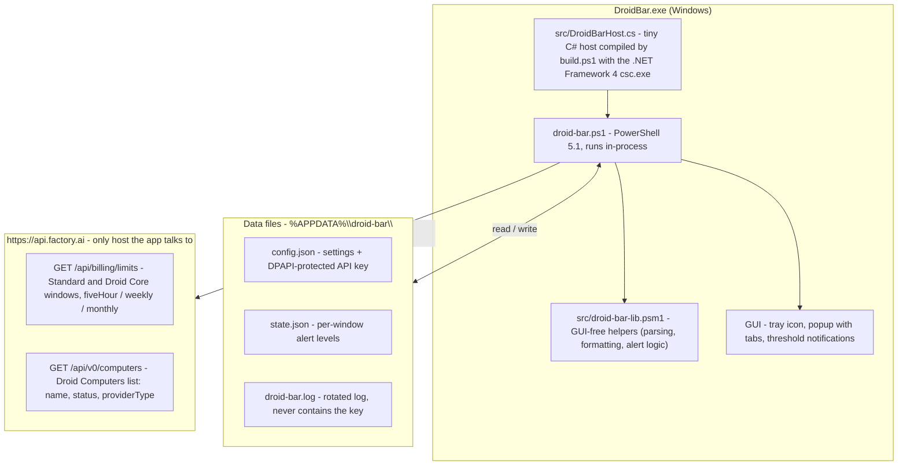

# Architecture

This is the architecture of Droid Bar today. The GUI-free helper module
(`src/droid-bar-lib.psm1`) ships as part of the app and is covered by the Pester
suite; the popup renders Standard / Droid Core / Computer tabs from a tab
registry, and the Droid Computers fetch runs on the same poll cycle as the
limits fetch.

## How the pieces fit

- **`DroidBar.exe`** (`src/DroidBarHost.cs`) is a minimal C# host so Windows shows the
  process as "Droid Bar" instead of "Windows PowerShell". It runs `droid-bar.ps1`
  in-process; `$PSScriptRoot` still resolves to the exe folder.
- **`droid-bar.ps1`** owns everything GUI and lifecycle: WinForms/GDI drawing, P/Invoke,
  the tray icon and popup, polling timer, threshold notifications, and the DPAPI key
  handling. It imports `src/droid-bar-lib.psm1` from `$PSScriptRoot\src` at startup and
  reads/writes the shared data-layer state through the module's accessors. Dev flags
  (`-Mock`, `-Preview`, `-PreviewTab`, `-Dump`) short-circuit the GUI for validation.
- **Tab registry** (`Get-TabRegistry` in the lib module) is the single source of truth for
  the popup header tabs (id, label, width): it drives the header pills, the mouse
  hit-test rects and the click switch. The `computer` tab is registered there but is
  deliberately **not** a `$Pools` key, so it can never opt into notifications.
- **The Computer tab is display-only**: the same poll cycle fetches `GET /api/v0/computers`
  (contained errors: a computers failure never touches the limits display), and the tab
  shows a summary line plus one row per machine (name, provider type, color-coded status
  chip). The popup height is content-aware and grows with the machine list.
- **`src/droid-bar-lib.psm1`** holds the GUI-free, testable helpers (parsing, formatting,
  alert computation, tray look). It imports cleanly on pwsh/Linux so the Pester suite can
  run anywhere; the release zip ships it alongside the script.
- **State** lives in `%APPDATA%\droid-bar\`: `config.json` (settings, DPAPI-protected key),
  `state.json` (which alert thresholds already fired per window), and `droid-bar.log`.
- **The API key** is only ever sent as a Bearer token to `api.factory.ai`. It is never
  logged and the app makes no other network calls (no telemetry).
