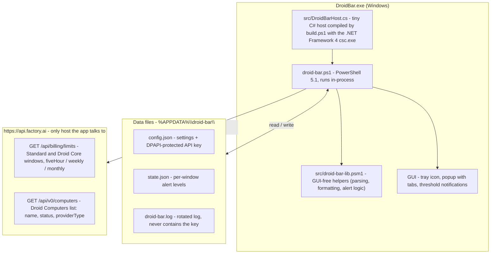

# Architecture

This is the target architecture of Droid Bar; components land incrementally as
milestones ship (the GUI-free helper module and the Droid Computers fetch are the
newest additions).

## How the pieces fit

- **`DroidBar.exe`** (`src/DroidBarHost.cs`) is a minimal C# host so Windows shows the
  process as "Droid Bar" instead of "Windows PowerShell". It runs `droid-bar.ps1`
  in-process; `$PSScriptRoot` still resolves to the exe folder.
- **`droid-bar.ps1`** owns everything GUI and lifecycle: WinForms/GDI drawing, P/Invoke,
  the tray icon and popup, polling timer, threshold notifications, and the DPAPI key
  handling. Dev flags (`-Mock`, `-Preview`, `-Dump`) short-circuit the GUI for validation.
- **`src/droid-bar-lib.psm1`** holds the GUI-free, testable helpers (parsing, formatting,
  alert computation). It imports cleanly on pwsh/Linux so the Pester suite can run anywhere;
  the release zip ships it alongside the script.
- **State** lives in `%APPDATA%\droid-bar\`: `config.json` (settings, DPAPI-protected key),
  `state.json` (which alert thresholds already fired per window), and `droid-bar.log`.
- **The API key** is only ever sent as a Bearer token to `api.factory.ai`. It is never
  logged and the app makes no other network calls (no telemetry).
